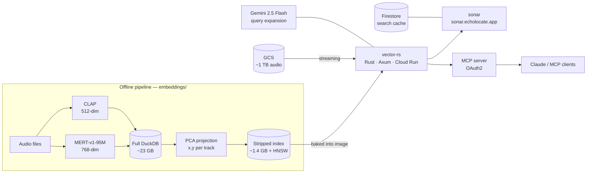

<p align="center">
  <a href="https://sonar.echolocate.app/">
    
  </a>
</p>

<h1 align="center">EchoLocate</h1>

<p align="center">
  Audio-embedding search over a music library — a 2D sonar map UI,
  a Rust vector-search engine, and an MCP server that exposes the same search to AI agents.
</p>

<p align="center">
  <a href="https://github.com/along528/echolocate/actions/workflows/ci.yml"></a>
  <a href="https://github.com/along528/echolocate/actions/workflows/vector-rs-deploy.yml"></a>
  <a href="https://github.com/along528/echolocate/actions/workflows/sonar-deploy.yml"></a>
</p>

---

Every track is embedded twice: [MERT](https://arxiv.org/abs/2306.00107) (768-dim) captures how it *sounds*, [CLAP](https://arxiv.org/abs/2206.04769) (512-dim) captures how it matches *language*. A PCA projection of the MERT vectors gives every track an `x,y` coordinate. There are three ways to explore it:

- **In the browser** — [sonar.echolocate.app](https://sonar.echolocate.app/) renders the corpus as a 2D map; clicking any coordinate — including empty space — returns the nearest track in the corpus.
- **By description** — a query like "warm analog synths" or "aggressive drums with distorted guitar" is embedded with CLAP and matched against the audio embeddings.
- **Via agents** — Claude (or any MCP client) connects to the remote MCP server and gets the same search, similarity, and playlist primitives.

The reasoning behind the architecture — why DuckDB+VSS over a vector database, why the index is baked into the container image, why two embedding models, what the 2D projection trades away — is written up in [**DESIGN.md**](DESIGN.md).

<!-- TODO: screenshot of the sonar map at https://sonar.echolocate.app (desktop map view with results + a trail) — save to docs/assets/sonar-map.png and uncomment: -->
<!-- <p align="center"></p> -->

## 🗺️ The sonar map — `sonar/`

React + Vite frontend, deployed as its own Cloud Run service at [sonar.echolocate.app](https://sonar.echolocate.app/).

- **Map ⇄ List** views of the same results. The map is a 2D PCA of each track's MERT `v_mid` embedding, drawn over a dimmed backdrop sample of the full corpus (`GET /map/backdrop`) so results have spatial context.
- **Click-to-probe**: clicking empty map space asks the backend for the globally nearest track to that coordinate (`GET /map/nearest`), so probing covers the full corpus, not just loaded results.
- **Vibe chips**: per-track mood tags computed live by the vector service (`GET /tracks/{id}/vibes`) as CLAP cosine similarity against a fixed vocabulary — no genre metadata is stored. Clicking a chip launches it as a new search layer.
- **Playlist builder**: layer searches, solo/hide them, then chain tracks into a reorderable playlist backed by sonic interpolation.
- **Now-playing card** with a seekable waveform computed from the actual audio — streamed from GCS, decoded with the Web Audio API, and downsampled to peaks client-side.
- Separate desktop and mobile layouts driven by one shared state hook.

Details: [`sonar/README.md`](sonar/README.md)

## ⚡ The engine — `vector-rs/`

Rust/Axum vector-search service on Cloud Run. DuckDB with the VSS extension provides HNSW cosine indexes over both embedding spaces; the CLAP text encoder runs in-process via ONNX Runtime; Gemini 2.5 Flash optionally rewrites terse queries into descriptive acoustic captions before embedding.

The service is a ground-up rewrite of the original Python implementation. The Python service stayed deployed as a **differential-testing oracle** during the migration — one script ([`verify_service.py`](vector-rs/scripts/verify_service.py)) ran identical requests against both and compared endpoint-by-endpoint before cutover. It now lives on the [`legacy`](https://github.com/along528/echolocate/tree/legacy) branch; the rewrite story is in [DESIGN.md](DESIGN.md).

The defining design decision is the **baked-index architecture**. The full database is ~23 GB, and serving it over a GCS FUSE mount meant HNSW's random I/O pattern produced **~250 s cold starts**. Instead, a stripped ~1.4 GB index (metadata + `v_mid` + `v_clap` + map coordinates + HNSW indexes) is `COPY`'d into the container image as its own layer. Cloud Run gen2 streams image blocks lazily, and startup runs everything in parallel — page-cache preload, HNSW warmup on both indexes, ONNX model load, GCS and Gemini client init:

| Metric | Value |
|--------|-------|
| Cold start | ~250 s (FUSE) → **~10–15 s** (baked index, Rust) |
| Semantic search p50 | ~250 ms |
| Semantic search p99 | ~600 ms |
| Compute cost | ~$0–$0.10/user/day (scale-to-zero) |
| Audio storage | ~$0.30/day (~1 TB FMA audio, GCS nearline) |

The cold-start comparison bundles two changes: the storage strategy (FUSE mount → baked index) and the runtime (Python → Rust). The mount was the dominant cost — HNSW random reads over a network filesystem — while the rewrite removed the interpreter/framework startup tax and enabled the fully parallel warmup. The two effects weren't measured separately; [DESIGN.md](DESIGN.md) breaks down the reasoning.

**Interpolation** — methods for constructing a path from one track to another through real tracks:

- `greedy_walk` (default): walk the neighbor graph, each hop picking the track closest to the destination.
- Recursive bisection: snap the vector midpoint of each segment to its nearest real track, then recurse into both halves.
- `slerp`: spherical interpolation along the embedding hypersphere.
- `linear`: straight vector averaging.
- Bézier steering: bend the path through one or more "steer" tracks to shape the character of the path.

Details, endpoints, and the dev-sandbox docs: [`vector-rs/README.md`](vector-rs/README.md)

## 📏 Retrieval quality — `finetune/` + `echoes/`

Semantic search quality is measured, not eyeballed. The loop:

1. **Label in the app** — every search is logged as a `SearchEvent`; relevance labels (`relevant` / `borderline` / `wrong`) applied to results become `LabelEvent`s. Both land in GCS via the engine's `/labels/*` endpoints.
2. **Review** — [echoes.echolocate.app](https://echoes.echolocate.app/) is an internal inspector UI over the raw event stream.
3. **Freeze** — [`finetune/src/eval/build_qrels.py`](finetune/src/eval/build_qrels.py) dedupes the labels into a versioned qrels file: currently **252 graded judgments over 38 queries** (from 724 search events).
4. **Score** — [`run_baseline.py`](finetune/src/eval/run_baseline.py) replays each query deterministically against a corpus snapshot and reports **NDCG@10** (graded, exponential gain), **recall@10**, and **judged@10 coverage** — the trust signal for how much of each top-10 is actually judged:

| Query subset | n | NDCG@10 | Recall@10 | judged@10 |
|---|---|---|---|---|
| All scored | 34 | **0.439** | 0.510 | 0.38 |
| Well-judged (≥5 judgments) | 17 | **0.581** | 0.658 | 0.72 |
| Best-judged (≥10 judgments) | 11 | **0.642** | 0.710 | 0.87 |

The harness has already earned its keep: replaying **raw** queries instead of their Gemini-expanded captions collapses NDCG@10 from ~0.44 to **~0.09** — the query expansion isn't cosmetic, it carries the retrieval path for short queries. Full methodology, per-query results, and the honest caveats (FMA-only labels, sparse judgments) are in [`finetune/BASELINE.md`](finetune/BASELINE.md).

This baseline is frozen as the yardstick for the next step: **LoRA fine-tuning CLAP** on the personal library ([plan](finetune/CLAP_FINETUNING_PLAN.md)). Groundwork done so far: local-inference parity with production proven (min cosine 0.9997 over 50 tracks, [`MODEL_CARD.md`](finetune/MODEL_CARD.md)) and a 1.26M-pair contrastive dataset built with album-leakage-safe splits and all eval-judged tracks held out. Training is next — see Roadmap.

## 🤖 Agents — `mcp/`

A remote MCP server (Starlette, OAuth2 + JWT) exposes the engine to any MCP client:

| Tool | What it does |
|------|--------------|
| `echolocate_sample` | Sample or page through tracks in the index |
| `echolocate_similar` | Nearest neighbors to a track's MERT embedding |
| `echolocate_text_search` | Metadata search by artist / album / title |
| `echolocate_semantic_search` | Text-to-audio "vibe" search via CLAP, with optional AI query expansion |
| `echolocate_interpolate` | Tracks that sonically bridge two tracks (greedy walk / slerp / linear, optional steering) |
| `echolocate_generate_playlist` | A complete playlist path between two tracks |

A request like "a 20-track playlist that starts ambient and ends in breakbeat" decomposes into two `echolocate_semantic_search` calls to pick the endpoints and one `echolocate_generate_playlist` call to interpolate between them.

The repository is also set up for agent development. A [SessionStart hook](.claude/hooks/session-start.sh) provisions a full Rust dev sandbox on every Claude Code on the web session — libduckdb, ONNX Runtime, the VSS extension, the CLAP model, and a committed 600-track sample index — so a session starts in a container where `cargo test` runs integration tests against every API route. See [`.claude/README.md`](.claude/README.md).

## 🚀 CI/CD

GitHub Actions, keyless via Workload Identity Federation (no long-lived service-account keys), path-filtered per service:

| Workflow | Trigger | What it does |
|----------|---------|--------------|
| [`vector-rs-ci`](.github/workflows/vector-rs-ci.yml) | PR / push touching `vector-rs/**` | Provisions native deps, `cargo build --release` + `cargo test` |
| [`vector-rs-deploy`](.github/workflows/vector-rs-deploy.yml) | Push to `main` | Bakes the ~1.4 GB production index from GCS, deploys, pins traffic |
| [`sonar-deploy`](.github/workflows/sonar-deploy.yml) | Push to `main` | Builds with the live vector-rs URL baked in, deploys the serving revision |
| [`*-pr-preview`](.github/workflows/) | PR opened / updated | Deploys a tagged, no-traffic Cloud Run revision and comments the live URL on the PR |
| [`*-pr-cleanup`](.github/workflows/) | PR closed | Tears the preview down |

Two notable details:

- **Cross-service previews**: if a PR touches both `sonar/` and `vector-rs/`, the sonar preview automatically points at that same PR's vector-rs preview — a full-stack preview environment per PR, with no additional configuration.
- **Idempotent deploys**: `vector-rs-deploy` compares the commit SHA and the GCS index generation against the serving revision's env vars and skips the build entirely when nothing changed. PR previews bake the small committed sample index; only deploys from `main` fetch the production index.

## How it fits together



## Repo map

| Directory | What it is |
|-----------|------------|
| [`sonar/`](sonar/) | Sonar map frontend (React + Vite) → [sonar.echolocate.app](https://sonar.echolocate.app/) |
| [`vector-rs/`](vector-rs/) | Vector-search engine (Rust/Axum) — primary deployment |
| [`mcp/`](mcp/) | Remote MCP server (OAuth2) exposing the `echolocate_*` tools |
| [`embeddings/`](embeddings/) | MERT + CLAP pipeline, DB / projection / index builders |
| [`echoes/`](echoes/) | Eval-label inspector over search/label events → echoes.echolocate.app |
| [`finetune/`](finetune/) | CLAP fine-tuning workspace — NDCG@10 eval harness, frozen baseline, contrastive dataset |
| [`fma-ingest/`](fma-ingest/) | Cloud Run job ingesting [Free Music Archive](https://github.com/mdeff/fma) audio |
| [`firestore/`](firestore/) | Security rules for the semantic-search cache |

The original Python vector service and first-generation browser UI are archived on the [`legacy`](https://github.com/along528/echolocate/tree/legacy) branch — see the rewrite story in [DESIGN.md](DESIGN.md).

## Quick start

```bash
# Vector engine (Rust) — port 8080
cd vector-rs && INDEX_DB_PATH=../data/index.duckdb cargo run

# Sonar frontend — port 5180
cd sonar && npm install && VITE_VECTOR_API_URL=<vector-url> npm run dev

# MCP server — port 8080
cd mcp && python main.py
```

Pushes to `main` deploy automatically via the workflows above; `./deploy.sh` does a full manual deploy (vector-rs → MCP → firestore). Per-service deploy scripts, domain mapping, environment variables, and verification live in [`vector-rs/README.md`](vector-rs/README.md), [`sonar/README.md`](sonar/README.md), and [`mcp/`](mcp/).

## Contributing

Commits follow [Conventional Commits](https://www.conventionalcommits.org) (enforced on PRs) and merges to `main` are versioned and released automatically via semantic-release. See [**CONTRIBUTING.md**](CONTRIBUTING.md) for the full flow.

## Roadmap

- **CLAP LoRA fine-tuning** — fine-tune the CLAP audio encoder on the personal library (`finetune/`). Baseline frozen (NDCG@10 0.44 scored / 0.64 best-judged), inference parity proven, training dataset built; LoRA training and post-tune eval are next.
- **Retire the legacy apex domain** — repoint [echolocate.app](https://echolocate.app/) from the archived first-generation UI to the sonar map.
- **Asymmetric phase matching** — score transitions on the delta between one track's *outro* and the next track's *intro* embeddings, treating similarity as directional.
- **k-NN shortest path** — build a nearest-neighbor graph and find true shortest paths instead of recursive bisection.
- **Audio-to-text explanations** — generate natural-language descriptions from embeddings to explain *why* two tracks are neighbors.
- **Wider audio sampling** — average embeddings across multiple windows per track rather than a single 5-second segment.

## Acknowledgements

- [Free Music Archive (FMA)](https://github.com/mdeff/fma) — audio dataset used for indexing.
- [MERT: Acoustic Music Understanding Model with Large-Scale Self-Supervised Training](https://arxiv.org/abs/2306.00107) — audio embeddings for sonic similarity.
- [CLAP: Learning Audio Concepts from Natural Language Supervision](https://arxiv.org/abs/2206.04769) — text-to-audio embeddings for semantic search.
- [HNSW: Efficient and Robust Approximate Nearest Neighbor Search](https://arxiv.org/abs/1603.09320) — the algorithm behind the DuckDB vector indexes.
